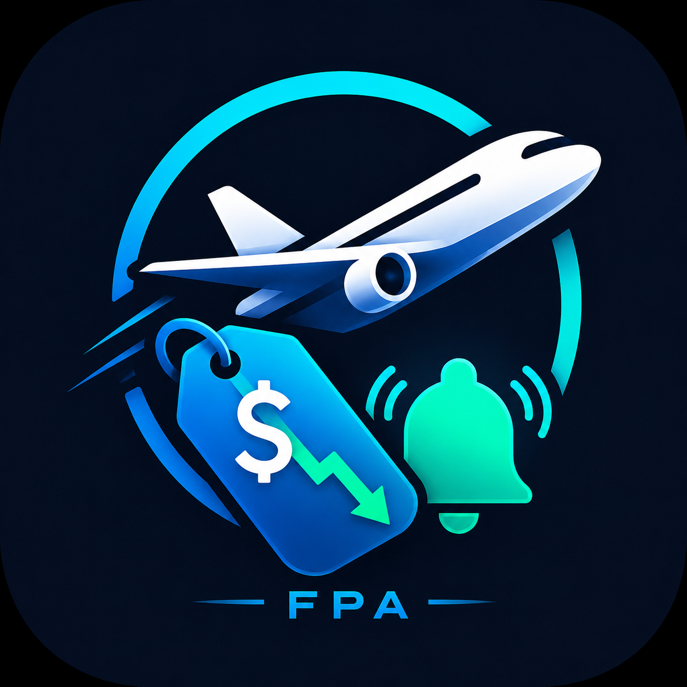

<div align="center">



# Flight Price Alert

Monitor gratuito de preços de passagens aéreas com alertas no Discord, histórico em SQLite, pesquisas com datas exatas ou flexíveis e análises opcionais por IA.

</div>

---

## Sobre o projeto

O **Flight Price Alert** consulta preços de passagens aéreas automaticamente e envia uma notificação quando encontra uma oferta dentro da meta configurada.

O projeto suporta dois tipos de monitoramento:

- **Datas exatas:** pesquisa uma data específica de ida e volta.
- **Grade flexível:** percorre diferentes combinações de datas e durações de viagem de forma rotativa.

As consultas podem ser executadas localmente ou automaticamente pelo GitHub Actions, sem a necessidade de manter o computador ligado.

## Principais recursos

- Consulta de preços reais por meio do Google Flights via SerpApi.
- Pesquisa de datas exatas.
- Pesquisa flexível com grade rotativa de datas.
- Suporte a múltiplos aeroportos de destino.
- Comparação com um preço-alvo.
- Histórico de preços armazenado em SQLite.
- Identificação do menor preço registrado.
- Detecção de queda ou aumento desde a consulta anterior.
- Prevenção de alertas duplicados.
- Alertas personalizados enviados ao Discord.
- Análise opcional do preço usando Gemini.
- Execução automática pelo GitHub Actions.
- Testes automatizados com Pytest.
- Qualidade de código com Ruff.
- Gerenciamento de dependências com uv.

## Funcionamento

```text
Configuração da rota
        ↓
Consulta ao Google Flights
        ↓
Preço encontrado
        ↓
Comparação com a meta
        ↓
Consulta ao histórico SQLite
        ↓
Política de alertas
        ↓
Análise opcional do Gemini
        ↓
Notificação no Discord
```

## Tipos de monitoramento

### Datas exatas

O monitor tradicional pesquisa uma combinação específica de ida e volta.

Exemplo:

```json
{
  "routes": [
    {
      "origin": "VIX",
      "destination": "EZE",
      "departure_date": "2027-06-01",
      "return_date": "2027-06-10",
      "target_price": "2500.00",
      "direct_only": false,
      "minimum_alert_drop": "50.00"
    }
  ]
}
```

Arquivo:

```text
config/routes.json
```

Execução:

```powershell
uv run flight-alert
```

### Grade flexível rotativa

A grade flexível gera combinações de datas a partir de:

- dias possíveis de saída;
- durações possíveis da viagem;
- um ou mais aeroportos de destino.

Exemplo:

```json
{
  "searches": [
    {
      "origin": "VIX",
      "destination_name": "Buenos Aires",
      "destination_airports": ["AEP", "EZE"],
      "year": 2027,
      "month": 6,
      "departure_days": [1, 6, 11, 16, 21, 26, 30],
      "trip_lengths": [5, 8, 12],
      "target_price": "2500.00",
      "direct_only": false,
      "minimum_alert_drop": "50.00"
    }
  ]
}
```

Arquivo:

```text
config/flexible_routes.json
```

Nesse exemplo, o bot gera:

```text
7 dias de saída × 3 durações = 21 combinações
```

Apenas uma combinação é consultada por execução.

O cursor é salvo no SQLite:

```text
Execução 1 → opção 1 de 21
Execução 2 → opção 2 de 21
Execução 3 → opção 3 de 21
...
Execução 21 → opção 21 de 21
Execução 22 → opção 1 de 21
```

Execução:

```powershell
uv run flight-alert-flexible
```

## Regras de alerta

Um alerta é enviado quando:

- o preço entra na meta pela primeira vez;
- o preço estava acima da meta e volta a ficar dentro dela;
- o preço cai pelo menos o valor definido em `minimum_alert_drop` desde o último alerta.

Um alerta é suprimido quando:

- o preço está acima da meta;
- o preço permanece igual;
- a queda desde o último alerta é inferior ao limite configurado.

Exemplo:

```text
Último alerta: R$ 2.300,00
Queda mínima: R$ 50,00

Preço atual: R$ 2.280,00
Resultado: não alerta

Preço atual: R$ 2.240,00
Resultado: novo alerta
```

## Alertas no Discord

Os alertas apresentam informações como:

- rota;
- tipo de pesquisa;
- datas encontradas;
- duração da viagem;
- preço atual;
- preço-alvo;
- economia sobre a meta;
- companhia aérea;
- variação desde a consulta anterior;
- análise opcional da IA;
- link para o Google Flights.

A URL do webhook fica armazenada em variável de ambiente e nunca deve ser adicionada diretamente ao código.

## Análise com IA

A integração com Gemini é opcional.

Quando habilitada, a IA recebe somente informações relacionadas à pesquisa:

- rota;
- datas;
- preço atual;
- preço-alvo;
- preço anterior;
- menor preço anterior;
- motivo do alerta.

A IA não decide se o alerta será enviado. Essa decisão continua sendo feita pelas regras determinísticas do projeto.

Para desativar:

```dotenv
AI_INSIGHTS_ENABLED=false
```

Para ativar:

```dotenv
AI_INSIGHTS_ENABLED=true
GEMINI_API_KEY=SUA_CHAVE
GEMINI_MODEL=gemini-3.1-flash-lite
```

## Requisitos

- Windows, Linux ou macOS.
- Python 3.12 ou superior.
- Git.
- uv.
- Conta na SerpApi.
- Webhook do Discord.
- Chave do Gemini, somente caso a análise por IA seja habilitada.

## Instalação

Clone o repositório:

```powershell
git clone https://github.com/Jvlima27/flight-price-alert.git
```

Entre na pasta:

```powershell
cd flight-price-alert
```

Instale as dependências:

```powershell
uv sync
```

Confirme a instalação:

```powershell
uv run flight-alert
```

## Variáveis de ambiente

Copie o arquivo de exemplo:

```powershell
Copy-Item .env.example .env
```

Configure o `.env`:

```dotenv
FLIGHT_PROVIDER=serpapi
SERPAPI_API_KEY=SUA_CHAVE_DA_SERPAPI

DISCORD_WEBHOOK_URL=SUA_URL_DO_WEBHOOK

AI_INSIGHTS_ENABLED=true
GEMINI_API_KEY=SUA_CHAVE_DO_GEMINI
GEMINI_MODEL=gemini-3.1-flash-lite
```

O arquivo `.env` está incluído no `.gitignore` e não deve ser enviado ao GitHub.

## Comandos

Executar a rota com datas exatas:

```powershell
uv run flight-alert
```

Executar a próxima combinação da grade flexível:

```powershell
uv run flight-alert-flexible
```

Formatar o código:

```powershell
uv run ruff format .
```

Verificar problemas de código:

```powershell
uv run ruff check .
```

Aplicar correções automáticas:

```powershell
uv run ruff check . --fix
```

Executar os testes:

```powershell
uv run pytest
```

## GitHub Actions

O projeto possui dois workflows.

### CI

Executado automaticamente após um `push` ou em pull requests.

Valida:

- instalação do projeto;
- formatação;
- lint;
- testes automatizados.

Arquivo:

```text
.github/workflows/ci.yml
```

### Flight Price Monitor

Executa os monitores automaticamente.

Arquivo:

```text
.github/workflows/flight-price-monitor.yml
```

Agendamento utilizado:

```yaml
schedule:
  - cron: "17 */8 * * *"
    timezone: "America/Sao_Paulo"
```

Horários aproximados:

```text
00:17
08:17
16:17
```

O workflow também pode ser executado manualmente na aba **Actions** do GitHub.

## Segredos do GitHub

Configure em:

```text
Settings
→ Secrets and variables
→ Actions
→ Repository secrets
```

Segredos necessários:

```text
SERPAPI_API_KEY
DISCORD_WEBHOOK_URL
GEMINI_API_KEY
```

A chave do Gemini somente é necessária quando a análise por IA está habilitada.

## Persistência do histórico

O histórico local é armazenado em:

```text
data/flight_prices.db
```

O banco contém:

- preços encontrados;
- menor preço registrado;
- último alerta enviado;
- motivos dos alertas;
- posição atual do cursor flexível.

No GitHub Actions, a pasta `data` é restaurada e salva por meio do cache do workflow.

O cache é suficiente para este projeto pessoal, mas não deve ser tratado como um banco de dados permanente.

## Estrutura do projeto

```text
flight-price-alert/
├── .github/
│   └── workflows/
│       ├── ci.yml
│       └── flight-price-monitor.yml
├── assets/
│   └── flight-price-alert-icon.png
├── config/
│   ├── routes.json
│   └── flexible_routes.json
├── data/
├── src/
│   └── flight_alert/
│       ├── config/
│       ├── database/
│       ├── insights/
│       ├── models/
│       ├── notifications/
│       ├── providers/
│       ├── services/
│       ├── app.py
│       ├── flexible_app.py
│       ├── main.py
│       └── flexible_main.py
├── tests/
├── .env.example
├── .gitignore
├── .python-version
├── pyproject.toml
├── README.md
└── uv.lock
```

## Custos

O projeto foi desenvolvido para funcionar utilizando camadas gratuitas.

Entretanto, limites e condições dos provedores podem mudar. Antes de aumentar o número de rotas ou a frequência das consultas, verifique:

- cota da SerpApi;
- cota do Gemini;
- consumo do GitHub Actions.

O bot não controla ou bloqueia automaticamente uma cobrança caso o usuário habilite faturamento em algum serviço externo.

## Limitações conhecidas

- Nem todas as datas distantes possuem inventário disponível.
- O Google Flights pode não retornar ofertas para determinadas combinações.
- Os preços podem mudar entre a consulta e a abertura do link.
- O preço pode não incluir serviços adicionais, como bagagem ou seleção de assento.
- O cache do GitHub Actions pode ser removido.
- A grade flexível é uma amostragem, não uma pesquisa de todas as combinações possíveis.
- A disponibilidade depende dos dados retornados pelo provedor.

## Segurança

Nunca adicione ao repositório:

```text
.env
SERPAPI_API_KEY
GEMINI_API_KEY
DISCORD_WEBHOOK_URL
data/flight_prices.db
```

Caso uma chave ou webhook seja exposto, revogue-o e gere uma nova credencial.

## Status

O projeto atualmente possui:

- consulta real de passagens;
- datas exatas;
- grade flexível rotativa;
- histórico SQLite;
- controle de alertas duplicados;
- alertas no Discord;
- análises opcionais por Gemini;
- automação com GitHub Actions;
- testes automatizados.

## Próximas melhorias

- Página com histórico e gráficos.
- Comando para listar menores preços.
- Notificações por Telegram.
- Integração opcional com WhatsApp.
- Monitoramento da cota restante das APIs.
- Banco de dados remoto.
- Painel para cadastrar rotas sem editar arquivos JSON.
- Relatórios semanais de preços.

---

<div align="center">

Desenvolvido como um projeto pessoal de monitoramento de passagens aéreas.

</div>